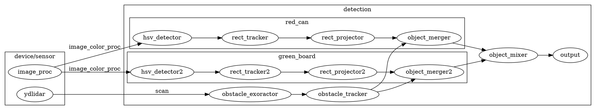

# SRS004 design

# Software System Overview

```plantuml
node user{
  node Joy
  node View
  node GlobalSetting
}

node GameApp

node NavigationSystem
node FireControlSystem
node ViewSystem
node SelectionSystem

node LocalizeFunction
node DetectFunction
database tf

Joy -d-> GameApp: joy
ViewSystem -u-> View: image
GlobalSetting --> GameApp: Freeze
GlobalSetting --> ViewSystem: HP

GameApp =d=> NavigationSystem: NavAction
GameApp =d=> FireControlSystem: GunAction
GameApp =d=> SelectionSystem: SelectionAction
GameApp =d=> ViewSystem: ViewAction

LocalizeFunction -u-> tf: self position
tf -u-> NavigationSystem
tf -u-> FireControlSystem
tf -u-> ViewSystem

SelectionSystem -l-> ViewSystem: focus

DetectFunction -u-> NavigationSystem: object
DetectFunction -u-> FireControlSystem: object
DetectFunction -u-> SelectionSystem: object
DetectFunction -u-> ViewSystem: object
/'
database objects
DetectFunction -u-> objects
objects -u-> NavigationSystem: object
objects -u-> FireControlSystem: object
objects -u-> SelectionSystem: object
objects -u-> ViewSystem: object
'/


frame CAN {
  node Omni
  node Gun
  node Body
  node System
}
NavigationSystem -d-> Omni: cmd_vel
Omni -u-> LocalizeFunction: odom
FireControlSystem -d-> Gun: point, shot, laser
Gun -u-> FireControlSystem: point
Body -u-> GlobalSetting: Hit
ViewSystem -d-> Body: Light
System -u-> ViewSystem: Bat
GlobalSetting -d-> Body: Color
Body -u-> NavigationSystem: range
Body -u-> ViewSystem: range

frame USB {
  node HeadCamera
  node FrontLidar
  node IMU
}
FrontLidar -u-> NavigationSystem: scan
FrontLidar -u-> LocalizeFunction: scan
FrontLidar -u-> DetectFunction: scan
FrontLidar -u-> ViewSystem: scan
HeadCamera -u-> DetectFunction: image
HeadCamera -u-> ViewSystem: image
IMU -u-> LocalizeFunction: imu
```

* s4_opertion: GameApp, ViewSystem
* s4_omni: NavigationSystem, LocalizeFunction
* s4_gun: FireControlSystem
* s4_sensor: SelectionSystem, DetectFunction


# Software Detail

## detection


# Hardware

## JoyCommand(Button)

| Button | Function |
|:-:|:-:|
| Triangle (Up) | Laser off |
| Square (Left) | Reset Gun |
| Circle (Right)  | Gun Tracking |
| Cross (Down) | Shot(+R1) |
| L1 | Move SpeedUp |
| L2 | Move Left |
| L3 | None |
| Allow Up | Select |
| Allow Left | None |
| Allow Right | None |
| Allow Down | None |
| L1 | Laser on & Gun SpeedDown |
| L2 | Move Right |
| L3 | None |

## JoyCommand(Axis)
| Axis | Function |
|:-:|:-:|
| RV | Move Foward |
| RH | Move Turn |
| LV | Gun Elevation |
| LH | Gun Train |


## CANLink & Power distribution
```plantuml
salt
{
  {T
    + PowerHub
    ++ WheelModule(ID:1)
    +++ GeerMotor
    +++ Encoder
    ++ WheelModule(ID:2)
    +++ GeerMotor
    +++ Encoder
    ++ WheelModule(ID:3)
    +++ GeerMotor
    +++ Encoder
    ++ BodyModule(ID:4)
    +++ HitSensor0
    +++ HitSensor1
    +++ HitSensor2
    +++ USrange0
    +++ USrange1
    +++ USrange2
    +++ FrontLight
    ++ GunModule(ID:5)
    +++ Servo0
    +++ Servo1
    +++ GunMotor
    +++ GunSW
    +++ Laser
    +++ MagageneMotor
    ++ CANAdapter(ID:Master)
    +++ RaspberryPi
    ++++ Camera
    ++++ IMU
    ++++ WiFi
    ++ LIDARPower(ID:None)
  }
}
```

## Part List (Mechanical)

| Group | Name | Quantity | price | shop |
|:-:|:-:|:-:|:-:|:-:|
| Wheel | GA370 | 3 | \1100 | Aliexpress |
|  | 38mmOmni | 3 | \432 | Viston |
|  | OmniHav | 3 | \270 | Viston |
| Gun | MechBox&Barrel | 1 | \5500 | TokyoMarui |
|  | StepperMotor | 1 | \400 | ? |
|  | GreenLaser | 1 | \1000 | Aliexpress |
|  | KRS4031 | 2 | \7000 | KondoKagaku |
| Sensor | WebCamera | 1 | \2300 | Baffalo |
|  | YDLIDAR | 1 | \11000 | Aliexpress |
|  | US-15 | 3 | \500 | Akizuki |
| Power | LiPo | 1 | \3000 | ? |
| System | RaspberryPi3B | 1 | \6000 | ? |
|  | WiFiModule | 1 | \4000 | ? |

SubTotal: \43200

## Part List (Electric boards)

| Group | Name | Quantity | price | shop |
|:-:|:-:|:-:|:-:|:-:|
| Wheel | WheelModuleController | 3 | \2000 | Make |
| Gun | GunModuleController | 1 | \3000 | Make |
| Body | BodyModuleController | 1 | \1500 | Make |
|  | LightBoard | 1 | \500 | Make |
|  | HitSensor | 3 | \1500 | Make |
| Sensor | YdlidarPowor | 1 | \1000 | Make |
| Power | PowerHub | 1 | \1500 | Make |
|  | PowerSwitchBoard | 1 | \1000 | Make |
| System | RasPower | 1 | \1000 | Make |
|  | ImuUSB | 1 | \1000 | Make |

Subtotal: \21000

## Develope Tool
| Group | Name | Quantity | price | shop |
|:-:|:-:|:-:|:-:|:-:|
| Develope | USBSerial | 1 | \1500 | Make |
