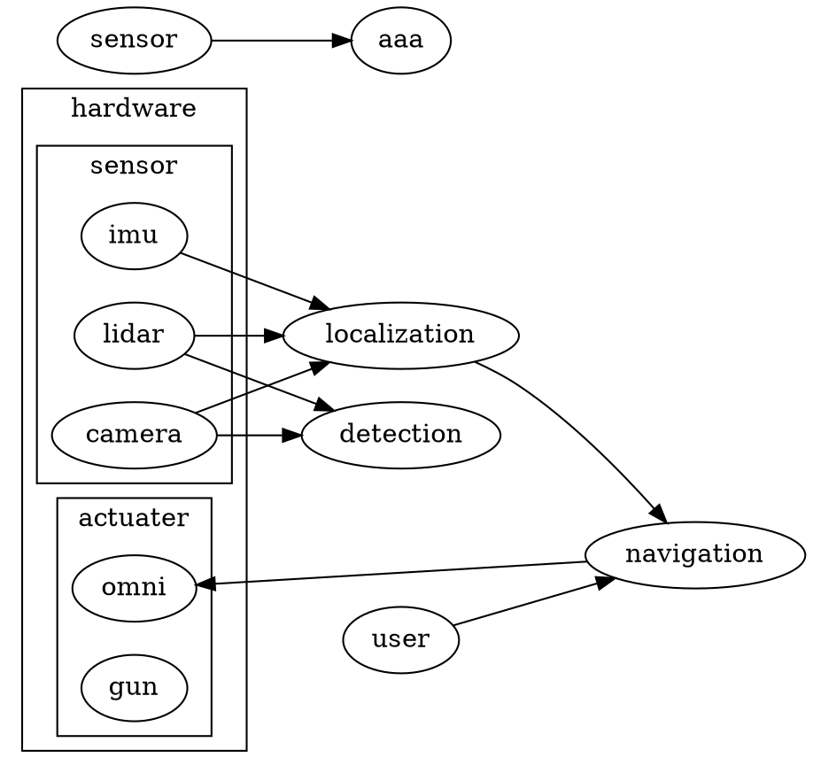
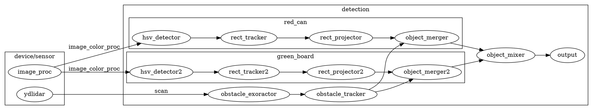

# SRS004 design

## overview


## detection



## uml

```plantuml
skinparam packageStyle node
hide members
hide circle

package device {
    package sensor0 {
        class ydlidar
        class uvc_camera
        class imu0
    }
}

package detection {
    class obstacle_detector
    ydlidar --> obstacle_detector
    package red_can {
        class color_detector
        class rect_tracker
        class rect_projector
        class rect_merger
        color_detector --> rect_tracker
        rect_tracker --> rect_projector
        rect_projector --> rect_merger
        obstacle_detector --> rect_merger
    }
}

browser --> browser2 : aaa

```

```plantuml
title 配置図の例

' PlantUMLには配置図用のダイアグラムがないので
' クラス図のパッケージで代用する。
' 以下は、パッケージをノード形式にする命令
skinparam packageStyle node

package BrowserClient {
     class browser
}
' ノードはパッケージであらわす
' パッケージの中に直接文字列を記載できないので
' クラスボックスで生成物を表現する

package "Rich Client\n{OS = Windows}" as RichClient {
     class artifact1 as "herculesClient.exe"
}
' PlantUMLのクラス図では、クラス名にピリオド「.」が含まれていると
' 名前空間を表してしまう。このため、これまでとは異なる順番でクラス名を記載している

package "Web server\n{OS =Solars}\n{web server = apache}\n{number deployed =3}" as WebServer {
     class artifact2 as "herculesWeb.war"
}

package "Application Server" as AppServer {
     class artifact3 as "JoveGL.exe\n{vendor = romanSoft}\n{component = General Ledger}"
     package "EJB Container" as EJB {
     	     class artifact4 as "herculesBase.ear"
     	     class artifact5 as "herculesAR.ear"
     	     class artifact6 as "herculesAP.ear"
     }
     package "Oracle DBS" as DB {
     }
}

BrowserClient -- WebServer : http/Internet
RichClient -- WebServer : http/LAN
WebServer -- AppServer : Java RMI/LAN
EJB -- DB : JDBC

note as Notice
     PlantUMLでは、配置図用の記法が用意されていない。
     この例ではクラス図を利用して、配置図を表している。
     クラスボックスが生成物、ノード形式のパッケージはノードを表している。
end note

' 以下は、クラスボックスを四角形だけの表示にする命令
hide members
hide circle```